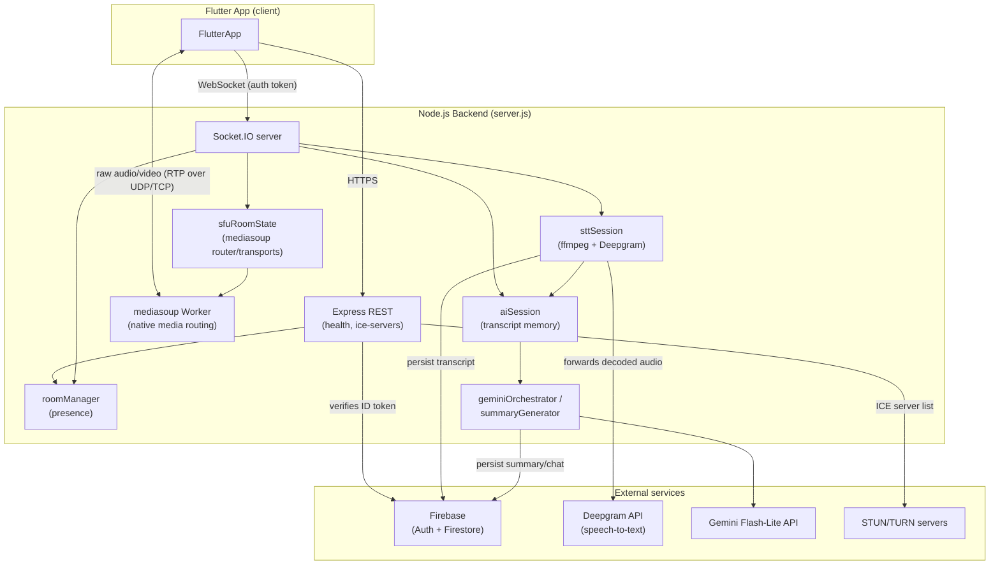
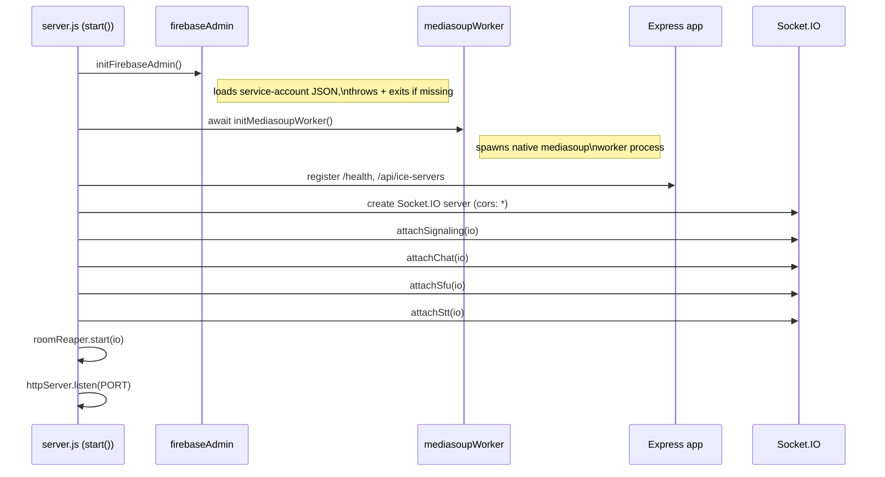
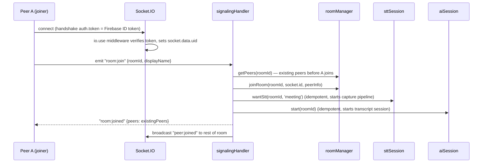
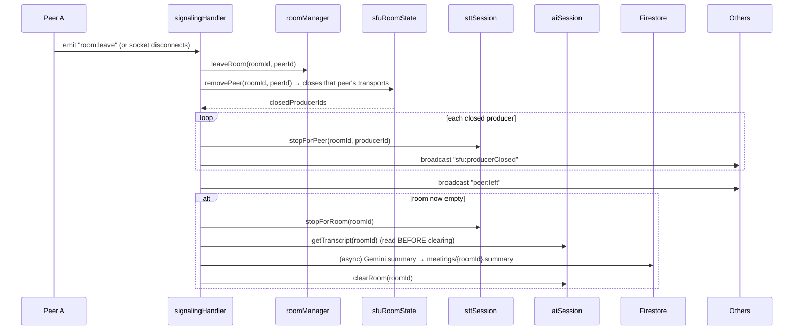
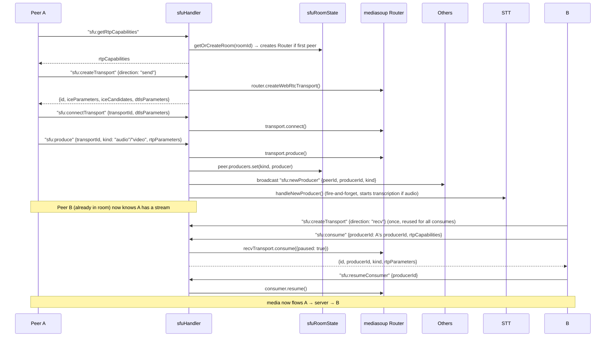
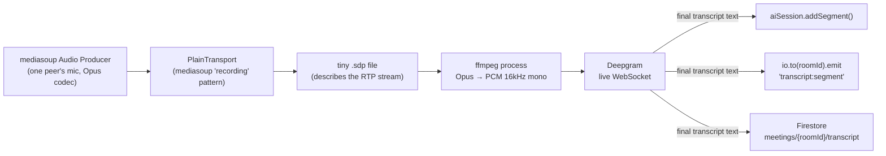
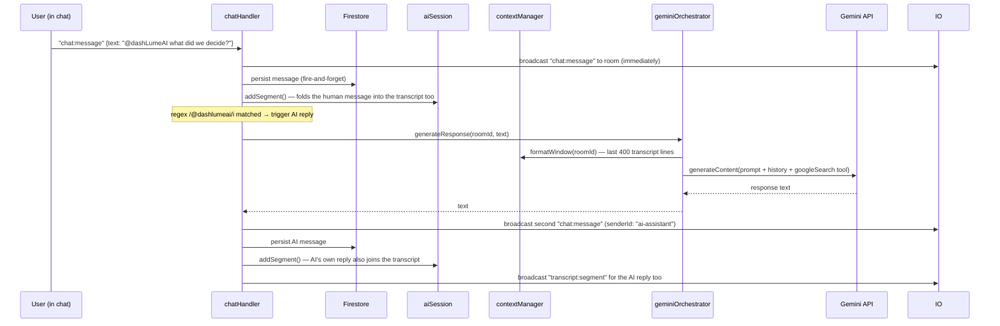

# CallMate AI Backend — Visual Architecture Guide

Goal of this doc: after reading it top to bottom, you should be able to open any
file in `backend/src` and already know *why* it exists, what calls it, and what
it calls — without asking an AI.

This backend is a **Node.js + Express + Socket.IO** server. Express handles two
plain HTTP endpoints. Everything else — video call signaling, chat, live
captions, AI replies — happens over **Socket.IO** (WebSockets), because those
need to push events to clients in real time, not just answer one request at a
time.

---

## 0. JavaScript/Node concepts you need before any of this makes sense

If you're new to JS backend code, these four patterns show up in *every* file:

1. **`require(...)` / `module.exports`** — Node's module system (CommonJS).
   Every file is its own private scope. Whatever you put in `module.exports`
   at the bottom is the only thing other files can see when they
   `require('./thatFile')`. Everything else in the file is private.

2. **`async function` / `await`** — almost everything here is asynchronous
   (network calls, talking to Firebase, spawning ffmpeg). `await somePromise`
   pauses *this function* until the promise resolves, without blocking the
   whole server. If you see a function marked `async`, assume it can pause.

3. **`Map`** — this backend has **no database for live state**. Active rooms,
   active peers, active SFU transports — all of it lives in plain JS `Map`
   objects in server memory (e.g. `rooms/roomManager.js`'s `const rooms = new
   Map()`). This means: **restarting the server wipes every live call.**
   Firestore is only used for *durable* records (chat history, transcripts,
   summaries) — never for the live in-memory room state.

4. **Event emitters (Socket.IO)** — instead of `request → response` like
   Express, Socket.IO is `socket.on('event:name', handler)`. A client sends a
   named event with a data payload; the server listens for that name and
   reacts. Some events also take a `callback` (called an "ack") so the client
   gets a direct reply, similar to a normal function return value.

Keep these four in your head — every diagram below is just these four ideas
wired together.

---

## 1. Folder map

```
backend/
├── src/
│   ├── server.js              ← entrypoint: boots everything, in a specific order
│   ├── config/
│   │   ├── env.js              reads .env, exposes typed config (port, keys, ICE servers)
│   │   └── firebaseAdmin.js    initializes Firebase Admin SDK (auth + Firestore)
│   ├── middleware/
│   │   └── authMiddleware.js   verifies Firebase ID tokens (used by REST AND sockets)
│   ├── routes/                 plain REST endpoints (Express)
│   │   ├── health.js            GET /health
│   │   └── iceServers.js        GET /api/ice-servers (STUN/TURN list, auth required)
│   ├── rooms/                  "who is in this call" — presence + its own socket handler
│   │   ├── roomManager.js       in-memory Map: roomId -> Map<peerId, peerInfo>
│   │   ├── roomReaper.js        safety-net: force-closes rooms idle > 4h
│   │   └── signalingHandler.js  room join/leave/end, presence broadcasts
│   ├── sfu/                    the actual media (audio/video) routing engine + its socket handler
│   │   ├── mediasoupWorker.js   one native mediasoup worker process for the app
│   │   ├── sfuRoomState.js      in-memory Map: roomId -> {router, peers(transports/producers/consumers)}
│   │   └── sfuHandler.js        WebRTC transport/produce/consume RPCs
│   ├── sockets/                Socket.IO event handlers for concerns without their own feature folder
│   │   ├── chatHandler.js       in-call text chat + "@dashLumeAI" trigger
│   │   └── sttHandler.js        AI-assistant / captions on-off toggles
│   ├── stt/
│   │   └── sttSession.js        captures audio from mediasoup, feeds Deepgram, broadcasts captions
│   └── ai/
│       ├── aiSession.js         per-room transcript storage (full history, in memory)
│       ├── contextManager.js    trims transcript to last 400 lines for prompts
│       ├── geminiOrchestrator.js builds the prompt, calls Gemini, returns one chat reply
│       └── summaryGenerator.js  end-of-call: one Gemini call -> summary + action items -> Firestore
├── .env / .env.example
└── package.json
```

`spikes/` is not shown above — those are one-off throwaway scripts used to
prove an API works during development (Gemini reachability, STT latency,
etc.). Nothing in `src/` imports from `spikes/`. Safe to ignore when learning
the real app.

---

## 2. The big picture — who talks to whom



Key thing to notice: **three independent Maps hold the state of one call**:
`roomManager` (who's present), `sfuRoomState` (media plumbing), `aiSession`
(transcript). They're kept separate on purpose — presence, media, and AI
context are different concerns that happen to share a `roomId`.

---

## 3. Server startup order (`server.js`)

Order matters here — later steps assume earlier ones finished.



If Firebase init or the mediasoup worker fails to start, `server.js` logs the
error and calls `process.exit(1)` — the server refuses to boot half-working.

---

## 4. Full call lifecycle — join to leave

This is the single most important diagram. Almost every file in `src/`
appears somewhere in this sequence.



Then the joiner sets up its media (see diagram 5), and any chat/captions flow
concurrently (diagrams 6–7). When they leave:



`room:end` (host ends the meeting for everyone) does the same teardown but
force-closes immediately regardless of remaining peers, and broadcasts
`room:ended` to the whole room. There's no server-side check that the caller
is actually the host — same trust model as the UI's "Host" badge.

`roomReaper.js` runs this same teardown every 30 minutes for any room idle
over 4 hours, as a safety net in case a crash skips the normal leave/end path.

---

## 5. Media (WebRTC via mediasoup SFU)

**Why an SFU?** In a mesh call, every phone sends video to every other phone
directly (N² connections — doesn't scale past ~4 people, brutal on mobile
batteries/data). An SFU (Selective Forwarding Unit) means every phone sends
its video **once**, to the server, and the server forwards it to everyone else.
`mediasoup` is the SFU engine here.

Core vocabulary used throughout `sfu/` (including `sfu/sfuHandler.js`):

| Term | What it means here |
|---|---|
| **Router** | One per room. Routes media between everyone in that room. |
| **WebRtcTransport** | One peer's "pipe" to the router. Each peer has a **send** transport (upload) and a **recv** transport (download). |
| **Producer** | A media track a peer is *sending* (one for mic audio, one for camera video). |
| **Consumer** | A media track a peer is *receiving* — one Consumer per Producer they want to watch/hear. |



A peer joining an already-active room calls `"sfu:getExistingProducers"` to
get everyone else's current producers up front, then runs the `consume` steps
above for each one.

---

## 6. Live captions / speech-to-text pipeline

This is the most "systems-y" part of the backend — it bridges mediasoup (raw
RTP media) to Deepgram (which wants a plain audio stream), using `ffmpeg` as
the format converter in between.



One `startCapture()` call = one producer being transcribed. It:
1. Makes a `PlainTransport` on the room's Router and consumes the target
   Producer onto it (mediasoup forwards raw RTP to a local UDP port instead of
   to a real WebRTC peer).
2. Writes a minimal SDP file so `ffmpeg` knows how to interpret that RTP
   stream (payload type / clock rate read from the actual negotiated codec).
3. Spawns `ffmpeg`, decoding Opus → raw 16kHz mono PCM on stdout.
4. Pipes that PCM into one Deepgram live-transcription WebSocket.
5. On each **final** (not interim) transcript result, appends it to
   `aiSession`, broadcasts `transcript:segment` to the room, and writes it to
   Firestore (fire-and-forget — a Firestore failure never blocks live
   captions).

**Refcounting matters here.** Two independent features — "Add AI Assistant"
and "Closed Captions" — can both want this same pipeline running.
`sttSession.wantStt(roomId, source)` / `unwantStt(...)` track a `Set` of
*wanters* per room (`'meeting' | 'ai' | 'cc'`). Capture only actually starts
when the set goes from empty→non-empty, and only stops when it goes back to
empty — so turning off Captions doesn't kill transcription if AI Assistant
(or the baseline `'meeting'` wanter, which is always present) still needs it.

---

## 7. AI chat replies (`@dashLumeAI`)



Notable design choices baked into this flow:
- The human's message is broadcast and persisted **before** Gemini is even
  called — a slow/failed AI call never delays the person's own message.
- The trigger is a simple **regex mention check**, not a toggle — the "Add AI
  Assistant" button only controls tile UI state (`aiSession.setToggle`), not
  whether Gemini can be triggered.
- Gemini is given **Google Search grounding** (`tools: [{googleSearch: {}}]`)
  so it can answer fact-checkable things (prices, versions, news) instead of
  relying on stale training data.

End-of-call summary (`summaryGenerator.js`) is the same idea but simpler: one
Gemini call over the **entire** transcript (not the 400-line window), fired
once when a room empties or is ended, writing `{summary, actionItems}` to
`meetings/{roomId}` in Firestore.

---

## 8. Socket.IO event cheat sheet

All events, grouped by handler file. `→` = server broadcasts to others in
room; `⇄` = client calls with an ack callback (request/response style).

**`signalingHandler.js`** (presence)
| Event | Direction | Payload |
|---|---|---|
| `room:join` | client→server | `{roomId, displayName}` |
| `room:joined` | server→joiner | `{peers: [...]}` |
| `peer:joined` | server→others | `{peerId, displayName, uid}` |
| `peer:muteState` / `peer:muteStateChanged` | client→server / server→others | `{isAudioMuted, isVideoMuted}` |
| `room:leave` | client→server | — |
| `peer:left` | server→others | `{peerId}` |
| `room:end` / `room:ended` | client→server / server→others | — |

**`sfuHandler.js`** (media, all `⇄` ack-style)
| Event | Returns |
|---|---|
| `sfu:getRtpCapabilities` | `{rtpCapabilities}` |
| `sfu:createTransport` | `{id, iceParameters, iceCandidates, dtlsParameters}` |
| `sfu:connectTransport` | `{connected: true}` |
| `sfu:produce` | `{id}` + broadcasts `sfu:newProducer` |
| `sfu:consume` | `{id, producerId, kind, rtpParameters}` |
| `sfu:resumeConsumer` | `{resumed: true}` |
| `sfu:getExistingProducers` | `[{peerId, producerId, kind}]` |

**`chatHandler.js`**
| Event | Direction |
|---|---|
| `chat:message` | client→server, then server→whole room (including sender) |

**`sttHandler.js`** (toggles)
| Event | Effect |
|---|---|
| `stt:start` / `stt:stop` | AI Assistant tile on/off → `ai:status` broadcast |
| `cc:start` / `cc:stop` | Captions on/off → `cc:status` broadcast |
| `ai:status:query` / `cc:status:query` | ack-style, for late joiners to sync UI |
| `transcript:segment` | server→room, unconditional whenever capture is running |

---

## 9. REST endpoints

| Method + path | Auth | Purpose |
|---|---|---|
| `GET /health` | none | liveness check, returns `{status: "ok"}` |
| `GET /api/ice-servers` | `requireAuth` (Bearer Firebase ID token) | returns STUN/TURN list for the client's `RTCPeerConnection` config |
| `GET /meeting/preview/:code` | none | anonymous, read-only meeting lookup for the web preview page — title, host name, live status, ICE servers |

Both authenticated REST auth and Socket.IO handshake auth funnel through the
same `verifyIdToken()` in `authMiddleware.js` — one token-verification path
for both transports. `GET /meeting/preview/:code` is the one exception: it
never checks Firebase, by design.

### Anonymous preview viewers (Socket.IO)

The Socket.IO handshake (`rooms/signalingHandler.js`) accepts a second,
unauthenticated auth mode: `socket.handshake.auth.previewCode` instead of
`auth.token`. This tags the socket `socket.data.role = 'viewer'` (vs. the
normal `'participant'`) and pins it to that one room. Viewers get a parallel
`preview:join` event (instead of `room:join`) that never touches
`roomManager`/STT/AI session — they're invisible to real participants and
don't show up in presence. `sfuHandler.js` rejects `sfu:createTransport`
(send direction) and `sfu:produce` for `role === 'viewer'`, so a preview
socket can consume every existing producer but can never publish its own
audio/video. `chatHandler.js` and `sttHandler.js` reject their mutating
events the same way — viewers can watch, not interact.

---

## 10. Mental model summary

- **Express** = two boring stateless HTTP endpoints. Not where the real app logic lives.
- **Socket.IO handlers** (`rooms/signalingHandler.js`, `sfu/sfuHandler.js`, `sockets/*.js`) = the real controllers. Each file owns one concern (presence, media RPCs, chat, toggles) and lives next to the state it manages where that state has its own folder.
- **State lives in `Map`s, not a database.** `roomManager`, `sfuRoomState`, `aiSession`, `sttSession`'s `activeRooms`/`roomWanters` — all in-memory, all wiped on restart, all keyed by `roomId`.
- **Firestore is the only durable store**, written to fire-and-forget alongside the live socket broadcasts (chat messages, transcript segments, end-of-call summary). A Firestore failure is logged, never blocks the live experience.
- **mediasoup** is a separate concern from Socket.IO signaling: sockets negotiate *who* sends/receives what, but the actual audio/video bytes flow over raw RTP (UDP/TCP), not through Socket.IO at all.
- **Deepgram and Gemini** are the only two paid external AI APIs; both are called from the `stt/` and `ai/` folders respectively, never directly from `sockets/`.

If you get lost in a file, ask: *is this presence, media, chat, captions, or
AI?* — that's the file's home folder, and diagrams 4–7 above show exactly
where it sits in the sequence.
